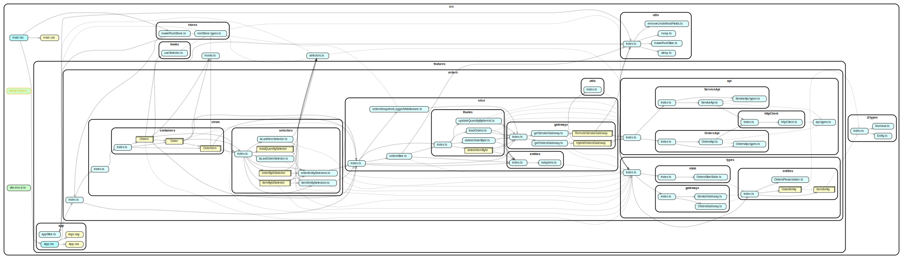

# Fontend Clean Architecture with React and Redux Toolkit

The repository provides an example React application that uses Redux Toolkit with [Clean Architecture](https://blog.cleancoder.com/uncle-bob/2012/08/13/the-clean-architecture.html) applied.

## Benefits

1. Independent and reusable code units with separated concerns.
2. Unified control and data flow.
3. Testable code.
4. Low cognitive load when working with a codebase.

## Definitions

- **Business Entity**: Unit that encapsulates business rules and data.
- **Business Rules and Data**: The most general and high-level rules and data that are presentation-agnostic. They are the least likely to change when something external changes.
- **Presentation (UI) Entity**: Unit that encapsulates presentation rules and data.
- **Presentation Rules and Data**: Rules and data that represent how the UI is currently displayed.
- **Store**: An aggregate unit with set of business and/or presentation entities or other stores.
- **State**: The value of a store, which is often an object.
- **Valid State**: One of a finite number of store values that is conceptually considered valid.
- **View Model**: The state transformed into a form required for presentation in a view (e.g. a React Component).
- **Gateway**: Unit that provides external services (stateful, switches services, maps data, caches data).
- **Selector**: Unit that derives additional values from the state as needed.
- **Transaction (reducer function)**: Unit with a logic that transitions a store between two valid states.
- **Use Case (async thunk)**: Unit that orchestrates the flow of data in applications, contains application lever logic.
- **Controller**: An adapter unit that handles input from the view and converts it into a state change with the help of use cases.
- **Presenter**: An adapter unit that handles the state and converts it into view models for the view with the help of selectors.

## Dependency Graphs

Dependency graph of the code units.



## Examples of Units Implementation and Specs

- [deleteItemById](src/features/orders/thunks/deleteItemById/deleteItemById.spec.ts)
- [useController](src/features/orders/views/containers/Orders/hooks/useController.spec.ts)
- [Orders](src/features/orders/views/containers/Orders/Orders.spec.tsx)
- [OrderItem](src/features/orders/views/containers/OrderItem/OrderItem.spec.tsx)
- [HybridOrdersGateway](src/features/orders/gateways/HybridOrdersGateway/HybridOrdersGateway.spec.ts)
- [RemoteOrdersGateway](src/features/orders/gateways/HybridOrdersGateway/RemoteOrdersGateway/RemoteOrdersGateway.spec.ts)
- [LocalOrdersGateway](src/features/orders/gateways/HybridOrdersGateway/LocalOrdersGateway/LocalOrdersGateway.spec.ts)
- [itemByIdSelector](src/features/orders/selectors/itemByIdSelector/itemByIdSelector.spec.tsx)
- [totalQuantitySelector](src/features/orders/selectors/totalQuantitySelector/totalQuantitySelector.spec.tsx)

## Units Lifecycle

For the units implementation, it is suggested to use Cluster Lifecycle model described in this [article](docs/the-new-culture-of-software-development-reflection.pdf), where generalization is important and mandatory step.

## File Structure of Orders Module

```console
./src/features/orders
├── api
│   ├── OrdersApi
│   │   ├── OrdersApi.factory.ts
│   │   ├── OrdersApi.ts
│   │   ├── OrdersApi.types.ts
│   │   └── index.ts
│   ├── ServiceApi
│   │   ├── ServiceApi.ts
│   │   ├── ServiceApi.types.ts
│   │   └── index.ts
│   ├── api.types.ts
│   ├── httpClient
│   │   ├── httpClient.ts
│   │   └── index.ts
│   └── index.ts
├── index.ts
├── slice
│   ├── entities
│   │   ├── adapters.ts
│   │   └── index.ts
│   ├── gateways
│   │   ├── HybridOrdersGateway
│   │   │   ├── HybridOrdersGateway.spec.ts
│   │   │   ├── HybridOrdersGateway.ts
│   │   │   ├── LocalOrdersGateway
│   │   │   │   ├── LocalOrdersGateway.spec.ts
│   │   │   │   ├── LocalOrdersGateway.ts
│   │   │   │   └── index.ts
│   │   │   ├── RemoteOrdersGateway
│   │   │   │   ├── RemoteOrdersGateway.spec.ts
│   │   │   │   ├── RemoteOrdersGateway.ts
│   │   │   │   ├── RemoteOrdersGateway.utils.ts
│   │   │   │   └── index.ts
│   │   │   └── index.ts
│   │   ├── RemoteServiceGateway
│   │   │   ├── RemoteServiceGateway.ts
│   │   │   ├── RemoteServiceGatewayStub.ts
│   │   │   └── index.ts
│   │   ├── getOrdersGateway.ts
│   │   ├── getServiceGateway.ts
│   │   └── index.ts
│   ├── index.ts
│   ├── ordersSlice.ts
│   ├── ordersSnapshotLoggerMiddleware.ts
│   └── thunks
│       ├── deleteItemById
│       │   ├── deleteItemById.spec.ts
│       │   ├── deleteItemById.ts
│       │   └── index.ts
│       ├── deleteOrderById.ts
│       ├── index.ts
│       ├── loadOrders.ts
│       └── updateQuantityByItemId.ts
├── types
│   ├── entities
│   │   ├── ItemEntity
│   │   │   ├── ItemEntity.ts
│   │   │   └── index.ts
│   │   ├── OrderEntity
│   │   │   ├── OrderEntity.ts
│   │   │   └── index.ts
│   │   ├── OrdersPresentation.ts
│   │   └── index.ts
│   ├── gateways
│   │   ├── OrdersGateway.ts
│   │   ├── ServiceGateway.ts
│   │   └── index.ts
│   ├── index.ts
│   └── state
│       ├── OrdersSliceState.ts
│       └── index.ts
├── utils
│   ├── index.ts
│   └── testing
│       ├── ItemEntity.factory.ts
│       ├── OrderEntity.factory.ts
│       ├── index.ts
│       └── makeTestOrderEntities.ts
└── views
    ├── containers
    │   ├── Order
    │   │   ├── Order.tsx
    │   │   ├── Order.types.ts
    │   │   ├── hooks
    │   │   │   ├── index.ts
    │   │   │   ├── useController.ts
    │   │   │   └── usePresenter.ts
    │   │   └── index.ts
    │   ├── OrderItem
    │   │   ├── OrderItem.spec.tsx
    │   │   ├── OrderItem.tsx
    │   │   ├── OrderItem.types.ts
    │   │   ├── hooks
    │   │   │   ├── index.ts
    │   │   │   ├── useController.ts
    │   │   │   └── usePresenter.ts
    │   │   └── index.ts
    │   ├── Orders
    │   │   ├── Orders.spec.tsx
    │   │   ├── Orders.tsx
    │   │   ├── Orders.types.ts
    │   │   ├── hooks
    │   │   │   ├── index.ts
    │   │   │   ├── useController.spec.ts
    │   │   │   ├── useController.ts
    │   │   │   └── usePresenter.ts
    │   │   └── index.ts
    │   └── index.ts
    ├── index.ts
    ├── selectors
    │   ├── index.ts
    │   ├── isLastItemSelector.ts
    │   ├── isLastOrderSelector.ts
    │   ├── itemByIdSelector
    │   │   ├── index.ts
    │   │   ├── itemByIdSelector.spec.tsx
    │   │   └── itemByIdSelector.ts
    │   ├── itemEntitySelectors.ts
    │   ├── orderByIdSelector
    │   │   ├── index.ts
    │   │   └── orderByIdSelector.ts
    │   ├── orderEntitySelectors.ts
    │   └── totalQuantitySelector
    │       ├── index.ts
    │       ├── totalQuantitySelector.spec.tsx
    │       └── totalQuantitySelector.ts
    └── testIds.ts
```
